# Spring Boot源码分析

## Spring Boot启动器

### spring.factories 分析

`spring-boot-2.0.1.RELEASE.jar!/META-INF/spring.factories `

```properties
# PropertySource Loaders
org.springframework.boot.env.PropertySourceLoader=\
org.springframework.boot.env.PropertiesPropertySourceLoader,\
org.springframework.boot.env.YamlPropertySourceLoader

# Run Listeners
org.springframework.boot.SpringApplicationRunListener=\
org.springframework.boot.context.event.EventPublishingRunListener

# Error Reporters
org.springframework.boot.SpringBootExceptionReporter=\
org.springframework.boot.diagnostics.FailureAnalyzers

# Application Context Initializers
org.springframework.context.ApplicationContextInitializer=\
org.springframework.boot.context.ConfigurationWarningsApplicationContextInitializer,\
org.springframework.boot.context.ContextIdApplicationContextInitializer,\
org.springframework.boot.context.config.DelegatingApplicationContextInitializer,\
org.springframework.boot.web.context.ServerPortInfoApplicationContextInitializer

# Application Listeners
org.springframework.context.ApplicationListener=\
org.springframework.boot.ClearCachesApplicationListener,\
org.springframework.boot.builder.ParentContextCloserApplicationListener,\
org.springframework.boot.context.FileEncodingApplicationListener,\
org.springframework.boot.context.config.AnsiOutputApplicationListener,\
org.springframework.boot.context.config.ConfigFileApplicationListener,\
org.springframework.boot.context.config.DelegatingApplicationListener,\
org.springframework.boot.context.logging.ClasspathLoggingApplicationListener,\
org.springframework.boot.context.logging.LoggingApplicationListener,\
org.springframework.boot.liquibase.LiquibaseServiceLocatorApplicationListener

# Environment Post Processors
org.springframework.boot.env.EnvironmentPostProcessor=\
org.springframework.boot.cloud.CloudFoundryVcapEnvironmentPostProcessor,\
org.springframework.boot.env.SpringApplicationJsonEnvironmentPostProcessor,\
org.springframework.boot.env.SystemEnvironmentPropertySourceEnvironmentPostProcessor

# Failure Analyzers
org.springframework.boot.diagnostics.FailureAnalyzer=\
org.springframework.boot.diagnostics.analyzer.BeanCurrentlyInCreationFailureAnalyzer,\
org.springframework.boot.diagnostics.analyzer.BeanNotOfRequiredTypeFailureAnalyzer,\
org.springframework.boot.diagnostics.analyzer.BindFailureAnalyzer,\
org.springframework.boot.diagnostics.analyzer.BindValidationFailureAnalyzer,\
org.springframework.boot.diagnostics.analyzer.UnboundConfigurationPropertyFailureAnalyzer,\
org.springframework.boot.diagnostics.analyzer.ConnectorStartFailureAnalyzer,\
org.springframework.boot.diagnostics.analyzer.NoUniqueBeanDefinitionFailureAnalyzer,\
org.springframework.boot.diagnostics.analyzer.PortInUseFailureAnalyzer,\
org.springframework.boot.diagnostics.analyzer.ValidationExceptionFailureAnalyzer,\
org.springframework.boot.diagnostics.analyzer.InvalidConfigurationPropertyNameFailureAnalyzer,\
org.springframework.boot.diagnostics.analyzer.InvalidConfigurationPropertyValueFailureAnalyzer

# FailureAnalysisReporters
org.springframework.boot.diagnostics.FailureAnalysisReporter=\
org.springframework.boot.diagnostics.LoggingFailureAnalysisReporter

```


`jar:file:/spring-boot-autoconfigure-2.0.1.RELEASE.jar!/META-INF/spring.factories`

```properties
# Initializers
org.springframework.context.ApplicationContextInitializer=\
org.springframework.boot.autoconfigure.SharedMetadataReaderFactoryContextInitializer,\
org.springframework.boot.autoconfigure.logging.ConditionEvaluationReportLoggingListener

# Application Listeners
org.springframework.context.ApplicationListener=\
org.springframework.boot.autoconfigure.BackgroundPreinitializer

# Auto Configuration Import Listeners
org.springframework.boot.autoconfigure.AutoConfigurationImportListener=\
org.springframework.boot.autoconfigure.condition.ConditionEvaluationReportAutoConfigurationImportListener

# Auto Configuration Import Filters
org.springframework.boot.autoconfigure.AutoConfigurationImportFilter=\
org.springframework.boot.autoconfigure.condition.OnClassCondition

# Auto Configure
org.springframework.boot.autoconfigure.EnableAutoConfiguration=\
org.springframework.boot.autoconfigure.admin.SpringApplicationAdminJmxAutoConfiguration,\
org.springframework.boot.autoconfigure.aop.AopAutoConfiguration,\
org.springframework.boot.autoconfigure.amqp.RabbitAutoConfiguration,\
org.springframework.boot.autoconfigure.batch.BatchAutoConfiguration,\
org.springframework.boot.autoconfigure.cache.CacheAutoConfiguration,\
org.springframework.boot.autoconfigure.cassandra.CassandraAutoConfiguration,\
org.springframework.boot.autoconfigure.cloud.CloudAutoConfiguration,\
org.springframework.boot.autoconfigure.context.ConfigurationPropertiesAutoConfiguration,\
org.springframework.boot.autoconfigure.context.MessageSourceAutoConfiguration,\
org.springframework.boot.autoconfigure.context.PropertyPlaceholderAutoConfiguration,\
org.springframework.boot.autoconfigure.couchbase.CouchbaseAutoConfiguration,\
org.springframework.boot.autoconfigure.dao.PersistenceExceptionTranslationAutoConfiguration,\
org.springframework.boot.autoconfigure.data.cassandra.CassandraDataAutoConfiguration,\
org.springframework.boot.autoconfigure.data.cassandra.CassandraReactiveDataAutoConfiguration,\
org.springframework.boot.autoconfigure.data.cassandra.CassandraReactiveRepositoriesAutoConfiguration,\
org.springframework.boot.autoconfigure.data.cassandra.CassandraRepositoriesAutoConfiguration,\
org.springframework.boot.autoconfigure.data.couchbase.CouchbaseDataAutoConfiguration,\
org.springframework.boot.autoconfigure.data.couchbase.CouchbaseReactiveDataAutoConfiguration,\
org.springframework.boot.autoconfigure.data.couchbase.CouchbaseReactiveRepositoriesAutoConfiguration,\
org.springframework.boot.autoconfigure.data.couchbase.CouchbaseRepositoriesAutoConfiguration,\
org.springframework.boot.autoconfigure.data.elasticsearch.ElasticsearchAutoConfiguration,\
org.springframework.boot.autoconfigure.data.elasticsearch.ElasticsearchDataAutoConfiguration,\
org.springframework.boot.autoconfigure.data.elasticsearch.ElasticsearchRepositoriesAutoConfiguration,\
org.springframework.boot.autoconfigure.data.jpa.JpaRepositoriesAutoConfiguration,\
org.springframework.boot.autoconfigure.data.ldap.LdapDataAutoConfiguration,\
org.springframework.boot.autoconfigure.data.ldap.LdapRepositoriesAutoConfiguration,\
org.springframework.boot.autoconfigure.data.mongo.MongoDataAutoConfiguration,\
org.springframework.boot.autoconfigure.data.mongo.MongoReactiveDataAutoConfiguration,\
org.springframework.boot.autoconfigure.data.mongo.MongoReactiveRepositoriesAutoConfiguration,\
org.springframework.boot.autoconfigure.data.mongo.MongoRepositoriesAutoConfiguration,\
org.springframework.boot.autoconfigure.data.neo4j.Neo4jDataAutoConfiguration,\
org.springframework.boot.autoconfigure.data.neo4j.Neo4jRepositoriesAutoConfiguration,\
org.springframework.boot.autoconfigure.data.solr.SolrRepositoriesAutoConfiguration,\
org.springframework.boot.autoconfigure.data.redis.RedisAutoConfiguration,\
org.springframework.boot.autoconfigure.data.redis.RedisReactiveAutoConfiguration,\
org.springframework.boot.autoconfigure.data.redis.RedisRepositoriesAutoConfiguration,\
org.springframework.boot.autoconfigure.data.rest.RepositoryRestMvcAutoConfiguration,\
org.springframework.boot.autoconfigure.data.web.SpringDataWebAutoConfiguration,\
org.springframework.boot.autoconfigure.elasticsearch.jest.JestAutoConfiguration,\
org.springframework.boot.autoconfigure.flyway.FlywayAutoConfiguration,\
org.springframework.boot.autoconfigure.freemarker.FreeMarkerAutoConfiguration,\
org.springframework.boot.autoconfigure.gson.GsonAutoConfiguration,\
org.springframework.boot.autoconfigure.h2.H2ConsoleAutoConfiguration,\
org.springframework.boot.autoconfigure.hateoas.HypermediaAutoConfiguration,\
org.springframework.boot.autoconfigure.hazelcast.HazelcastAutoConfiguration,\
org.springframework.boot.autoconfigure.hazelcast.HazelcastJpaDependencyAutoConfiguration,\
org.springframework.boot.autoconfigure.http.HttpMessageConvertersAutoConfiguration,\
org.springframework.boot.autoconfigure.http.codec.CodecsAutoConfiguration,\
org.springframework.boot.autoconfigure.influx.InfluxDbAutoConfiguration,\
org.springframework.boot.autoconfigure.info.ProjectInfoAutoConfiguration,\
org.springframework.boot.autoconfigure.integration.IntegrationAutoConfiguration,\
org.springframework.boot.autoconfigure.jackson.JacksonAutoConfiguration,\
org.springframework.boot.autoconfigure.jdbc.DataSourceAutoConfiguration,\
org.springframework.boot.autoconfigure.jdbc.JdbcTemplateAutoConfiguration,\
org.springframework.boot.autoconfigure.jdbc.JndiDataSourceAutoConfiguration,\
org.springframework.boot.autoconfigure.jdbc.XADataSourceAutoConfiguration,\
org.springframework.boot.autoconfigure.jdbc.DataSourceTransactionManagerAutoConfiguration,\
org.springframework.boot.autoconfigure.jms.JmsAutoConfiguration,\
org.springframework.boot.autoconfigure.jmx.JmxAutoConfiguration,\
org.springframework.boot.autoconfigure.jms.JndiConnectionFactoryAutoConfiguration,\
org.springframework.boot.autoconfigure.jms.activemq.ActiveMQAutoConfiguration,\
org.springframework.boot.autoconfigure.jms.artemis.ArtemisAutoConfiguration,\
org.springframework.boot.autoconfigure.groovy.template.GroovyTemplateAutoConfiguration,\
org.springframework.boot.autoconfigure.jersey.JerseyAutoConfiguration,\
org.springframework.boot.autoconfigure.jooq.JooqAutoConfiguration,\
org.springframework.boot.autoconfigure.jsonb.JsonbAutoConfiguration,\
org.springframework.boot.autoconfigure.kafka.KafkaAutoConfiguration,\
org.springframework.boot.autoconfigure.ldap.embedded.EmbeddedLdapAutoConfiguration,\
org.springframework.boot.autoconfigure.ldap.LdapAutoConfiguration,\
org.springframework.boot.autoconfigure.liquibase.LiquibaseAutoConfiguration,\
org.springframework.boot.autoconfigure.mail.MailSenderAutoConfiguration,\
org.springframework.boot.autoconfigure.mail.MailSenderValidatorAutoConfiguration,\
org.springframework.boot.autoconfigure.mongo.embedded.EmbeddedMongoAutoConfiguration,\
org.springframework.boot.autoconfigure.mongo.MongoAutoConfiguration,\
org.springframework.boot.autoconfigure.mongo.MongoReactiveAutoConfiguration,\
org.springframework.boot.autoconfigure.mustache.MustacheAutoConfiguration,\
org.springframework.boot.autoconfigure.orm.jpa.HibernateJpaAutoConfiguration,\
org.springframework.boot.autoconfigure.quartz.QuartzAutoConfiguration,\
org.springframework.boot.autoconfigure.reactor.core.ReactorCoreAutoConfiguration,\
org.springframework.boot.autoconfigure.security.servlet.SecurityAutoConfiguration,\
org.springframework.boot.autoconfigure.security.servlet.UserDetailsServiceAutoConfiguration,\
org.springframework.boot.autoconfigure.security.servlet.SecurityFilterAutoConfiguration,\
org.springframework.boot.autoconfigure.security.reactive.ReactiveSecurityAutoConfiguration,\
org.springframework.boot.autoconfigure.security.reactive.ReactiveUserDetailsServiceAutoConfiguration,\
org.springframework.boot.autoconfigure.sendgrid.SendGridAutoConfiguration,\
org.springframework.boot.autoconfigure.session.SessionAutoConfiguration,\
org.springframework.boot.autoconfigure.security.oauth2.client.OAuth2ClientAutoConfiguration,\
org.springframework.boot.autoconfigure.solr.SolrAutoConfiguration,\
org.springframework.boot.autoconfigure.thymeleaf.ThymeleafAutoConfiguration,\
org.springframework.boot.autoconfigure.transaction.TransactionAutoConfiguration,\
org.springframework.boot.autoconfigure.transaction.jta.JtaAutoConfiguration,\
org.springframework.boot.autoconfigure.validation.ValidationAutoConfiguration,\
org.springframework.boot.autoconfigure.web.client.RestTemplateAutoConfiguration,\
org.springframework.boot.autoconfigure.web.embedded.EmbeddedWebServerFactoryCustomizerAutoConfiguration,\
org.springframework.boot.autoconfigure.web.reactive.HttpHandlerAutoConfiguration,\
org.springframework.boot.autoconfigure.web.reactive.ReactiveWebServerFactoryAutoConfiguration,\
org.springframework.boot.autoconfigure.web.reactive.WebFluxAutoConfiguration,\
org.springframework.boot.autoconfigure.web.reactive.error.ErrorWebFluxAutoConfiguration,\
org.springframework.boot.autoconfigure.web.reactive.function.client.WebClientAutoConfiguration,\
org.springframework.boot.autoconfigure.web.servlet.DispatcherServletAutoConfiguration,\
org.springframework.boot.autoconfigure.web.servlet.ServletWebServerFactoryAutoConfiguration,\
org.springframework.boot.autoconfigure.web.servlet.error.ErrorMvcAutoConfiguration,\
org.springframework.boot.autoconfigure.web.servlet.HttpEncodingAutoConfiguration,\
org.springframework.boot.autoconfigure.web.servlet.MultipartAutoConfiguration,\
org.springframework.boot.autoconfigure.web.servlet.WebMvcAutoConfiguration,\
org.springframework.boot.autoconfigure.websocket.reactive.WebSocketReactiveAutoConfiguration,\
org.springframework.boot.autoconfigure.websocket.servlet.WebSocketServletAutoConfiguration,\
org.springframework.boot.autoconfigure.websocket.servlet.WebSocketMessagingAutoConfiguration,\
org.springframework.boot.autoconfigure.webservices.WebServicesAutoConfiguration

# Failure analyzers
org.springframework.boot.diagnostics.FailureAnalyzer=\
org.springframework.boot.autoconfigure.diagnostics.analyzer.NoSuchBeanDefinitionFailureAnalyzer,\
org.springframework.boot.autoconfigure.jdbc.DataSourceBeanCreationFailureAnalyzer,\
org.springframework.boot.autoconfigure.jdbc.HikariDriverConfigurationFailureAnalyzer,\
org.springframework.boot.autoconfigure.session.NonUniqueSessionRepositoryFailureAnalyzer

# Template availability providers
org.springframework.boot.autoconfigure.template.TemplateAvailabilityProvider=\
org.springframework.boot.autoconfigure.freemarker.FreeMarkerTemplateAvailabilityProvider,\
org.springframework.boot.autoconfigure.mustache.MustacheTemplateAvailabilityProvider,\
org.springframework.boot.autoconfigure.groovy.template.GroovyTemplateAvailabilityProvider,\
org.springframework.boot.autoconfigure.thymeleaf.ThymeleafTemplateAvailabilityProvider,\
org.springframework.boot.autoconfigure.web.servlet.JspTemplateAvailabilityProvider

```

`jar:file:/spring-beans-5.0.5.RELEASE.jar!/META-INF/spring.factories`

```properties
org.springframework.beans.BeanInfoFactory=org.springframework.beans.ExtendedBeanInfoFactory
```

### spring启动关键节节点流程图

```mermaid
graph TB

	DemoApplication ==> |"main()"|DemoApplicationMain["SpringApplication.run(DemoApplication.class, args)<br>实例化SpringApplication"]
	
	DemoApplicationMain==>|"new SpringApplication(primarySources)"|NewSpringApplication(实例化SpringApplication)
	

	
	NewSpringApplication-->|"loadSpringFactories(classLoader)"|loadSpringFactories("加载/META-INF/spring.factories<br>加载一次spring.factories后会缓存到ConcurrentHashMap")
	
	loadSpringFactories-->|"setInitializers((Collection) getSpringFactoriesInstances(ApplicationContextInitializer.class))"|SpringFactoriesApplicationContextInitializer("实例化spring.factories中key为ApplicationListener.class的类")
	
	SpringFactoriesApplicationContextInitializer-->|"setListeners((Collection) getSpringFactoriesInstances(ApplicationListener.class))"|SpringFactoriesApplicationListener("实例化spring.factories中key为ApplicationListener.class的类")

	SpringFactoriesApplicationListener-->|"deduceMainApplicationClass()"|deduceMainApplicationClass[推断main-application-class]
	
	deduceMainApplicationClass==>|"SpringApplication.run(args)"|SpringApplicationRun("实例化SpringApplication后<br>执行SpringApplication.run(args)")
	
	SpringApplicationRun-->|"listeners = getSpringFactoriesInstances(SpringApplicationRunListener.class)<br>listeners.starting()"|ApplicationRunListener["执行spring.factories中key为SpringApplicationRunListeners.starting()"]

	ApplicationRunListener-->|"new DefaultApplicationArguments(args)"|DefaultApplicationArguments("解析命令行参数,如：--spring.profiles.active")
	
	DefaultApplicationArguments-->|"prepareEnvironment(listeners,applicationArguments)"|prepareEnvironment(环境配置设置)
	
	prepareEnvironment-->|"spring.factories中SpringApplicationRunListener.environmentPrepared()"|environmentPrepared(触发环境准备好的environmentPrepared事件)
	
	environmentPrepared==>|"createApplicationContext()"|createApplicationContext("创建spring容器applicaitonContext：AnnotationConfigServletWebServerApplicationContext.class<br>
	applicaitonContext.reader = new AnnotatedBeanDefinitionReader(this);<br>
	//AnnotatedBeanDefinitionReader构造函数里：<br>
	// registerBeanDefinition(new RootBeanDefinition(ConfigurationClassPostProcessor.class))<br>
	// registerBeanDefinition(new RootBeanDefinition(AutowiredAnnotationBeanPostProcessor.class))<br>
	// registerBeanDefinition(new RootBeanDefinition(RequiredAnnotationBeanPostProcessor.class))<br>
	// registerBeanDefinition(new RootBeanDefinition(CommonAnnotationBeanPostProcessor.class))<br>
	// registerBeanDefinition(new RootBeanDefinition(EventListenerMethodProcessor.class))<br>
	// registerBeanDefinition(new RootBeanDefinition(DefaultEventListenerFactory.class))<br>
	applicaitonContext.scanner = new ClassPathBeanDefinitionScanner(this);
	")
	
	createApplicationContext-->|"getSpringFactoriesInstances(SpringBootExceptionReporter.class)"|SpringBootExceptionReporter("加载spring.factories中key为SpringBootExceptionReporter.class监听器")
	
	SpringBootExceptionReporter-->|"prepareContext(context, environment, listeners, applicationArguments,printedBanner)"|prepareContext("1、准备Spring容器:<br>
	2、context.setEnvironment(environment)<br>
	3、执行spring.factories中的ApplicationContextInitializer.initialize()<br>
	4、触发事件spring.factories中SpringApplicationRunListeners.contextPrepared()<br>
	5、注册Bean：registerSingleton('springApplicationArguments',applicationArguments)<br>
	6、注册DemoApplication为Bean:<br>createBeanDefinitionLoader(BeanDefinitionRegistry registry, Object[] sources).load()<br>
	7、触发事件spring.factories中SpringApplicationRunListeners.contextLoaded()")

	prepareContext==>|"SpringApplicaiton.refreshContext()<br>AbstractApplicationContext.refresh()"|refreshContext("Spring容器ApplicationContext所有重要内容的加载")
	
	refreshContext-->|"prepareRefresh()"|prepareRefresh("// Initialize any placeholder property sources in the context environment<br>
	initPropertySources();<br>
	// Validate that all properties marked as required are resolvable<br>
	// see ConfigurablePropertyResolver#setRequiredProperties<br>
	getEnvironment().validateRequiredProperties();")
	
	prepareRefresh-->|"prepareBeanFactory(beanFactory)"|prepareBeanFactory("// Tell the internal bean factory to use the context's class loader etc.<br>
		beanFactory.setBeanClassLoader(getClassLoader());<br>
		beanFactory.setBeanExpressionResolver(new <br>StandardBeanExpressionResolver(beanFactory.getBeanClassLoader()));<br>
		beanFactory.addPropertyEditorRegistrar(new ResourceEditorRegistrar(this, getEnvironment()));<br>
		// Configure the bean factory with context callbacks.<br>
		beanFactory.addBeanPostProcessor(new ApplicationContextAwareProcessor(this));<br>
		beanFactory.ignoreDependencyInterface(EnvironmentAware.class);<br>
		beanFactory.ignoreDependencyInterface(EmbeddedValueResolverAware.class);<br>
		beanFactory.ignoreDependencyInterface(ResourceLoaderAware.class);<br>
		beanFactory.ignoreDependencyInterface(ApplicationEventPublisherAware.class);<br>
		beanFactory.ignoreDependencyInterface(MessageSourceAware.class);<br>
		beanFactory.ignoreDependencyInterface(ApplicationContextAware.class);<br>
		// BeanFactory interface not registered as resolvable type in a plain factory.<br>
		// MessageSource registered (and found for autowiring) as a bean.<br>
		beanFactory.registerResolvableDependency(BeanFactory.class, beanFactory);<br>
		beanFactory.registerResolvableDependency(ResourceLoader.class, this);<br>
		beanFactory.registerResolvableDependency(ApplicationEventPublisher.class, this);<br>
		beanFactory.registerResolvableDependency(ApplicationContext.class, this);<br>
		// Register early post-processor for detecting inner beans as ApplicationListeners.<br>
		beanFactory.addBeanPostProcessor(new ApplicationListenerDetector(this));<br>
		beanFactory.registerSingleton('enviroment', getEnvironment());<br>
		beanFactory.registerSingleton('systemProperties', getEnvironment().getSystemProperties());<br>
		beanFactory.registerSingleton('systemEnvironment', getEnvironment().getSystemEnvironment());")
	
	prepareBeanFactory--> |"postProcessBeanFactory(beanFactory)"| postProcessBeanFactory("beanFactory.addBeanPostProcessor(new WebApplicationContextServletContextAwareProcessor(this));<br>
	beanFactory.ignoreDependencyInterface(ServletContextAware.class);")
		
	postProcessBeanFactory==> |"invokeBeanFactoryPostProcessors(beanFactory);<br>PostProcessorRegistrationDelegate.invokeBeanFactoryPostProcessors(beanFactory, getBeanFactoryPostProcessors());"| invokeBeanFactoryPostProcessors("Invoke factory processors registered as beans in the context")
	
	invokeBeanFactoryPostProcessors-->|"BeanDefinitionRegistryPostProcessor.postProcessBeanDefinitionRegistry(beanFactory)"|postProcessBeanDefinitionRegistry("1、多次调用BeanDefinitionRegistryPostProcessor.postProcessBeanDefinitionRegistry(beanFactory)")
	postProcessBeanDefinitionRegistry==>|"ConfigurationClassPostProcessor.postProcessBeanDefinitionRegistry(BeanDefinitionRegistry registry)"|ConfigurationClassPostProcessor("在此实现扫描Bean和spring boot的autoConfiguration")
	
	ConfigurationClassPostProcessor==>|"ConfigurationClassParser.parse()<br>ConfigurationClassParser.doProcessConfigurationClass(new DemoApplication)"|ConfigurationClassParser("处理启动类的注解<br>ConfigurationClassParser.doProcessConfigurationClass(new ConfigurationClass(DemoApplication.class))")
	
	ConfigurationClassParser-->|"processMemberClasses(configClass, sourceClass)"|processMemberClasses{"检查内部类是否注解为spring bean"}
	
	processMemberClasses-->|"如果有内部类,将类递归处理"|ConfigurationClassParser
	
	processMemberClasses-->|"如果没内部Bean类，下一步processPropertySource()"|processPropertySource("处理注解@PropertySource(name='', value='classpath:')")
	
	processPropertySource-->|"this.componentScanParser.parse()"|componentScanParser("处理注解@ComponentScan<br>ClassPathBeanDefinitionScanner.doScan(basePackages)<br>")
	
	componentScanParser-->|"扫描到Bean后，继续解析"|ConfigurationClassParser
	
	componentScanParser-->|"没扫描到Bean或没注解@ComponentScan，下一步processImports(configClass)"|processImports{"递归查询当前类，或注解中的@Import注解，并处理注解@Import中定义的类"}
	
	processImports-->|"如果有注解@Import，且类为接口ImportSelector.class的实现<br>则执行ImportSelector.selectImports(AnnotationMetadata)方法，将获取到的结果递归调用processImports，解析selectImports得到的结果，<br>若为非ImportSelector、ImportBeanDefinitionRegistrar类，注入到spring容器"|ImportSelector
	
	processImports-->|"如果没注解@Import,下一步configClass.addImportedResource()"|addImportedResource("处理注解@ImportResource")
	
	processImports-->|"如果有注解@Import，且类为接口ImportBeanDefinitionRegistrar.class的实现<br>则添加到importBeanDefinitionRegistrars中，注意该部分的数据在执行完parser.parse(configCandidates)后调用this.reader.loadBeanDefinitions(configClasses)解析"|ImportBeanDefinitionRegistrar("执行configClass.addImportBeanDefinitionRegistrar(registrar, currentSourceClass.getMetadata()<br>this.importBeanDefinitionRegistrars.put(registrar, importingClassMetadata)")
	
	
	
	addImportedResource-->|"addBeanMethod"|addBeanMethod("处理注解@Bean")
	
	addBeanMethod-->|"processInterfaces(configClass, sourceClass)"|processInterfaces("处理接口和父类，到此结束处理ConfigurationClass")
	processInterfaces==>|"ConfigurationClassParser.processDeferredImportSelectors()"|processDeferredImportSelectors("加载spring boot的autoConfiguration")
	
	processDeferredImportSelectors-->|"invokeBeanFactoryPostProcessors()"|invokeBeanFactoryPostProcessors2("调用postProcessBeanFactory callback")
			
			
	invokeBeanFactoryPostProcessors2-->|"registerBeanPostProcessors(beanFactory)"|registerBeanPostProcessors("Register bean processors that intercept bean creation")
	registerBeanPostProcessors-->|"BeanDefinitionRegistryPostProcessor.postProcessBeanDefinitionRegistry(BeanDefinitionRegistry registry)"|postProcessBeanDefinitionRegistry2222(调用postProcessBeanDefinitionRegistry)
	
	
```



> - `BeanFactoryPostProcessor`.`postProcessBeanFactory(ConfigurableListableBeanFactory beanFactory)` 是 `BeanFactory`的后处理类，在Bean被 *创建* 但还没被 *初始化* 的时候执行；
> - `BeanDefinitionRegistryPostProcessor` 是`BeanFactoryPostProcessor`的扩展，允许在`BeanFactoryPostProcessor`被调用之前对`BeanDefinition`做一些操作, 尤其是它可以注册`BeanFactoryPostProcessor`的`BeanDefinition`. 它提供了一个方法`postProcessBeanDefinitionRegistry()`, 这个方法被调用的时候, 所有的`BeanDefinition`已经被加载了, 但是所有的`Bean`还没被创建；
> - 所有的`Bean`生成都有个顺序： `定义BeanDefinition --A--> 创建(new实例化) --B--> 初始化`，`BeanDefinitionRegistryPostProcessor`的`postProcessBeanDefinitionRegistry`方法在A时执行，`BeanFactoryPostProcessor`的`postProcessBeanFactory`方法在B时执行。


main方法

```java
public static void main(String[] args) {
	ConfigurableApplicationContext application = SpringApplication.run(DemoApplication.class, args);

}
```

进入到`SpringApplicaiton.java`

```java
public static ConfigurableApplicationContext run(Class<?> primarySource,
			String... args) {
	return run(new Class<?>[] { primarySource }, args);
}
```

```java
public static ConfigurableApplicationContext run(Class<?>[] primarySources,
			String[] args) {
	return new SpringApplication(null, primarySources).run(args);
}
```

实例化`SpringApplicaiton`类，构造函数：

```java
public SpringApplication(ResourceLoader resourceLoader, Class<?>... primarySources) {
    this.resourceLoader = resourceLoader;
    this.primarySources = new LinkedHashSet<>(Arrays.asList(primarySources));
    this.webApplicationType = deduceWebApplicationType();
    //加载 Jar包中的 /META-INF/spring.factories，并实例化key为ApplicationContextInitializer.class的类，应用启动初始化回调
    setInitializers((Collection) getSpringFactoriesInstances(
        ApplicationContextInitializer.class));
    //原理同上：实例化可以为ApplicationListener.class的类，应用监听器
    setListeners((Collection) getSpringFactoriesInstances(ApplicationListener.class));
    this.mainApplicationClass = deduceMainApplicationClass();
}
```

进入`run`方法

```java
//记录程序运行时间
StopWatch stopWatch = new StopWatch();
stopWatch.start();
ConfigurableApplicationContext context = null;
Collection<SpringBootExceptionReporter> exceptionReporters = new ArrayList<>();
//System.setProperty("java.awt.headless", "true");
configureHeadlessProperty();
//加载 Jar包中的 /META-INF/spring.factories，并实例化key为SpringApplicationRunListener.class的类
SpringApplicationRunListeners listeners = getRunListeners(args);
//触发应用启动事件
listeners.starting();
try {
    //解析Program arguments，如：--spring.application.name=***
    ApplicationArguments applicationArguments = new DefaultApplicationArguments(
        args);
    ConfigurableEnvironment environment = prepareEnvironment(listeners,
                                                             applicationArguments);
    configureIgnoreBeanInfo(environment);
    //打印命令行Banner
    Banner printedBanner = printBanner(environment);
    //创建spring ConfigurableApplicationContext容器，AnnotationConfigServletWebServerApplicationContext实例，将在下节详细介绍
    context = createApplicationContext();
    // 获得spring.factory文件中，SpringBootExceptionReporter.class的类
    exceptionReporters = getSpringFactoriesInstances(
        SpringBootExceptionReporter.class,
        new Class[] { ConfigurableApplicationContext.class }, context);
    // 对context进行预设置
    prepareContext(context, environment, listeners, applicationArguments,
                   printedBanner);
    // 具体实现((AbstractApplicationContext) context).refresh()，将在下节详细介绍
    refreshContext(context);
    afterRefresh(context, applicationArguments);
    stopWatch.stop();
    if (this.logStartupInfo) {
        new StartupInfoLogger(this.mainApplicationClass)
            .logStarted(getApplicationLog(), stopWatch);
    }
    listeners.started(context);
    callRunners(context, applicationArguments);
}
catch (Throwable ex) {
    handleRunFailure(context, ex, exceptionReporters, listeners);
    throw new IllegalStateException(ex);
}

try {
    listeners.running(context);
}
catch (Throwable ex) {
    handleRunFailure(context, ex, exceptionReporters, null);
    throw new IllegalStateException(ex);
}
return context;
```


## Spring容器的创建

接上节`createApplicationContext()`

若依赖中不存在`pring-boot-starter-webflux` 则spring的ApplicationContext是 `AnnotationConfigServletWebServerApplicationContext`实例


`AnnotationConfigServletWebServerApplicationContext` extends `ServletWebServerApplicationContext` extends `GenericWebApplicationContext` extends ` GenericApplicationContext` extends `AbstractApplicationContext`

### Spring容器构造

实例化`AnnotationConfigServletWebServerApplicationContext`,构造函数：

```java
public AnnotationConfigServletWebServerApplicationContext() {
    this.classLoader = ClassUtils.getDefaultClassLoader();
    this.resourcePatternResolver = getResourcePatternResolver();
    this.beanFactory = new DefaultListableBeanFactory();
    // Reader的作用：从Resource中读取配置信息，把注解的bean解析成BeanDefinition对象
	this.reader = new AnnotatedBeanDefinitionReader(this);
	this.scanner = new ClassPathBeanDefinitionScanner(this);
}
```

实例化`AnnotatedBeanDefinitionReader`

```java
public AnnotatedBeanDefinitionReader(BeanDefinitionRegistry registry, Environment environment) {
    this.registry = registry;
    // 实例化ConditionEvaluator：
    // this.context = new ConditionContextImpl(registry, environment, resourceLoader);
    this.conditionEvaluator = new ConditionEvaluator(registry, environment, null);
    AnnotationConfigUtils.registerAnnotationConfigProcessors(this.registry);
}
```

`AnnotationConfigUtils.registerAnnotationConfigProcessors(this.registry)`具体的代码实现

```java
public static Set<BeanDefinitionHolder> registerAnnotationConfigProcessors(
    BeanDefinitionRegistry registry, @Nullable Object source) {
    // source is null
	// 转换registry类型为DefaultListableBeanFactory
    DefaultListableBeanFactory beanFactory = unwrapDefaultListableBeanFactory(registry);
    if (beanFactory != null) {
        if (!(beanFactory.getDependencyComparator() instanceof AnnotationAwareOrderComparator)) {
            beanFactory.setDependencyComparator(AnnotationAwareOrderComparator.INSTANCE);
        }
        if (!(beanFactory.getAutowireCandidateResolver() instanceof ContextAnnotationAutowireCandidateResolver)) {
            beanFactory.setAutowireCandidateResolver(new ContextAnnotationAutowireCandidateResolver());
        }
    }

    // BeanDefinitionHolder 封装bean定义相关信息，以及bean名称、别名等 
    Set<BeanDefinitionHolder> beanDefs = new LinkedHashSet<>(4);

    if (!registry.containsBeanDefinition(CONFIGURATION_ANNOTATION_PROCESSOR_BEAN_NAME)) {
        RootBeanDefinition def = new RootBeanDefinition(ConfigurationClassPostProcessor.class);
        def.setSource(source);
        beanDefs.add(registerPostProcessor(registry, def, CONFIGURATION_ANNOTATION_PROCESSOR_BEAN_NAME));
    }

    if (!registry.containsBeanDefinition(AUTOWIRED_ANNOTATION_PROCESSOR_BEAN_NAME)) {
        RootBeanDefinition def = new RootBeanDefinition(AutowiredAnnotationBeanPostProcessor.class);
        def.setSource(source);
        beanDefs.add(registerPostProcessor(registry, def, AUTOWIRED_ANNOTATION_PROCESSOR_BEAN_NAME));
    }

    if (!registry.containsBeanDefinition(REQUIRED_ANNOTATION_PROCESSOR_BEAN_NAME)) {
        RootBeanDefinition def = new RootBeanDefinition(RequiredAnnotationBeanPostProcessor.class);
        def.setSource(source);
        beanDefs.add(registerPostProcessor(registry, def, REQUIRED_ANNOTATION_PROCESSOR_BEAN_NAME));
    }

    // Check for JSR-250 support, and if present add the CommonAnnotationBeanPostProcessor.
    if (jsr250Present && !registry.containsBeanDefinition(COMMON_ANNOTATION_PROCESSOR_BEAN_NAME)) {
        RootBeanDefinition def = new RootBeanDefinition(CommonAnnotationBeanPostProcessor.class);
        def.setSource(source);
        beanDefs.add(registerPostProcessor(registry, def, COMMON_ANNOTATION_PROCESSOR_BEAN_NAME));
    }

    // Check for JPA support, and if present add the PersistenceAnnotationBeanPostProcessor.
    if (jpaPresent && !registry.containsBeanDefinition(PERSISTENCE_ANNOTATION_PROCESSOR_BEAN_NAME)) {
        RootBeanDefinition def = new RootBeanDefinition();
        try {
            def.setBeanClass(ClassUtils.forName(PERSISTENCE_ANNOTATION_PROCESSOR_CLASS_NAME,
                                                AnnotationConfigUtils.class.getClassLoader()));
        }
        catch (ClassNotFoundException ex) {
            throw new IllegalStateException(
                "Cannot load optional framework class: " + PERSISTENCE_ANNOTATION_PROCESSOR_CLASS_NAME, ex);
        }
        def.setSource(source);
        beanDefs.add(registerPostProcessor(registry, def, PERSISTENCE_ANNOTATION_PROCESSOR_BEAN_NAME));
    }

    if (!registry.containsBeanDefinition(EVENT_LISTENER_PROCESSOR_BEAN_NAME)) {
        RootBeanDefinition def = new RootBeanDefinition(EventListenerMethodProcessor.class);
        def.setSource(source);
        beanDefs.add(registerPostProcessor(registry, def, EVENT_LISTENER_PROCESSOR_BEAN_NAME));
    }
    if (!registry.containsBeanDefinition(EVENT_LISTENER_FACTORY_BEAN_NAME)) {
        RootBeanDefinition def = new RootBeanDefinition(DefaultEventListenerFactory.class);
        def.setSource(source);
        beanDefs.add(registerPostProcessor(registry, def, EVENT_LISTENER_FACTORY_BEAN_NAME));
    }

    return beanDefs;
}
```

> BeanDefinitionRegistry.registerBeanDefinition(beanName, beanDefinition)
>
> new BeanDefinitionHolder(beanDefinition, beanName)


### Bean定义

#### Bean的生命周期

1、调用`InstantiationAwareBeanPostProcessor`.`postProcessBeforeInstantiation(Class<?> beanClass, String beanName)` 

​      ↓

2、实例化 `new BeanName()` 

​      ↓

3、对实例做处理 `InstantiationAwareBeanPostProcessor`.`postProcessAfterInstantiation(Object bean, String beanName)` 

​    ↓

4、把xml中配置的bean属性值赋予给容器中的实例化之后的bean

​    ↓

5、调用`BeanPostProcessor`.`postProcessBeforeInitialization(Object bean, String beanName)`

​    ↓

6、调用`InitializingBean`.`afterPropertiesSet()`

​    ↓

7、调用通过`init-method`属性配置的初始化方法

​    ↓

8、调用`BeanPostProcessor`.`postProcessAfterInitialization(Object bean, String beanName)`

​    ↓

9、Spring缓存池中准备就绪的Bean


#### Bean的初始化

`SpringApplicaiton`.run()方法中：`refreshContext(context)`具体实现`((AbstractApplicationContext) context).refresh()`

```java
public void refresh() throws BeansException, IllegalStateException {
    synchronized (this.startupShutdownMonitor) {
        // Prepare this context for refreshing.
        prepareRefresh();

        // Tell the subclass to refresh the internal bean factory.
        ConfigurableListableBeanFactory beanFactory = obtainFreshBeanFactory();

        // Prepare the bean factory for use in this context.
        prepareBeanFactory(beanFactory);

        try {
            // Allows post-processing of the bean factory in context subclasses.
            // 如果配置basePackages，则this.scanner.scan(this.basePackages);
            // 如annotatedClasses，则this.reader.register(ClassUtils.toClassArray(this.annotatedClasses));
            postProcessBeanFactory(beanFactory);

            // Invoke factory processors registered as beans in the context.
            // 扫描Bean
            invokeBeanFactoryPostProcessors(beanFactory);

            // Register bean processors that intercept bean creation.
            registerBeanPostProcessors(beanFactory);

            // Initialize message source for this context.
            initMessageSource();

            // Initialize event multicaster for this context.
            initApplicationEventMulticaster();

            // Initialize other special beans in specific context subclasses.
            onRefresh();

            // Check for listener beans and register them.
            registerListeners();

            // Instantiate all remaining (non-lazy-init) singletons.
            finishBeanFactoryInitialization(beanFactory);

            // Last step: publish corresponding event.
            finishRefresh();
        }

        catch (BeansException ex) {
            if (logger.isWarnEnabled()) {
                logger.warn("Exception encountered during context initialization - " +
                            "cancelling refresh attempt: " + ex);
            }

            // Destroy already created singletons to avoid dangling resources.
            destroyBeans();

            // Reset 'active' flag.
            cancelRefresh(ex);

            // Propagate exception to caller.
            throw ex;
        }

        finally {
            // Reset common introspection caches in Spring's core, since we
            // might not ever need metadata for singleton beans anymore...
            resetCommonCaches();
        }
    }
}
```


